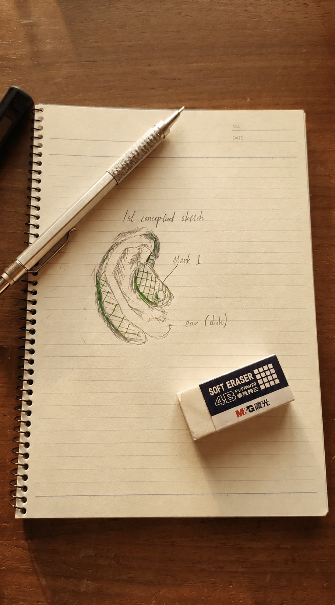
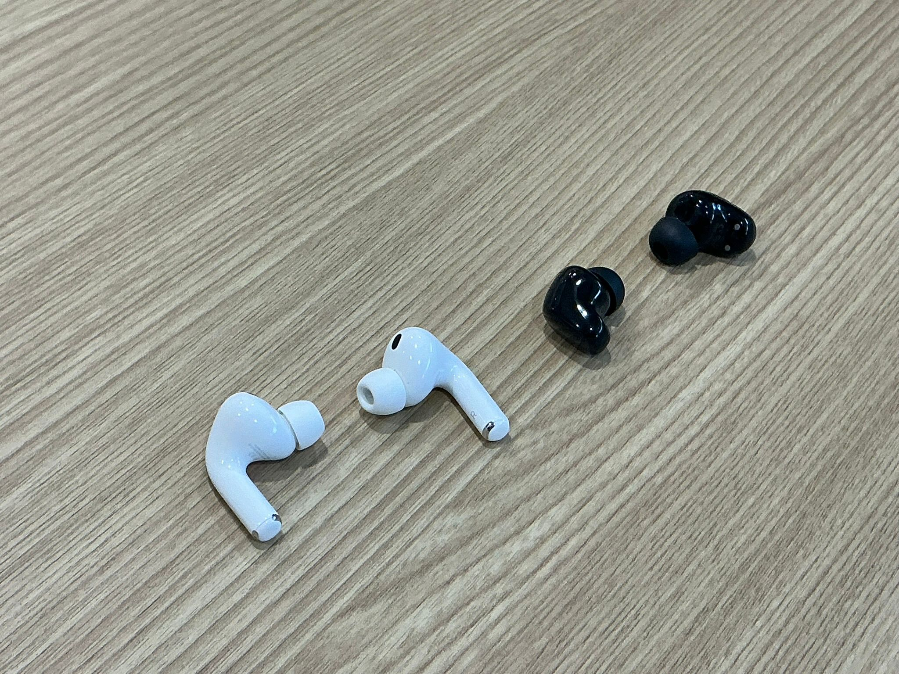

<!DOCTYPE html>
<html lang="en">
<head>
    <meta charset="UTF-8">
    <meta name="viewport" content="width=device-width, initial-scale=1.0">
    <title>Almetric Technologies | AL Buds 1 Campaign</title>
    <link href="https://fonts.googleapis.com/css2?family=Inter:wght@300;400;700&display=swap" rel="stylesheet">
    
</head>
<body>

    <!-- Hero Section -->
    <section class="hero">
        
Almetric Technologies

        <h1>AL Buds 1</h1>
        
Crowdfunding the AL Buds 1: Clinical-grade biometric monitoring meets professional audio ergonomics.

        
        <!-- Progress Tracker -->
        

            

                
Raised: $32,000 HKD

                
Goal: $40,000 HKD

            

            

                

            

            

                
67% Funded

                
14 Days Remaining

            

        

        

            <a href="#tiers" class="btn btn-primary">Back This Campaign</a>
            <a href="#learn-more" class="btn btn-outline">Learn More</a>
            <a href="#stretch-goals" class="btn btn-outline">Stretch Goals</a>
        

    </section>

    <!-- Learn More Section -->
    <section id="learn-more" class="section-padding" style="border-top: 1px solid #111;">
        <h2>The Technology</h2>
        
Almetric Technologies is redefining personal health. By utilizing the ear's unique vascularity, AL Buds 1 provide clinical-grade data that wrist-worn wearables simply cannot reach.

        
        

            

                
                Design Vision
                
The original sketch that kickstarted all of this.

            

            

                
                Final Prototype
                
Our current prototype, closer to perfection than ever.

            

        

        
Our design incorporates a discreet, weighted battery pack positioned comfortably behind the ear, ensuring perfect balance for all-day monitoring and high-fidelity listening.

    </section>

    <!-- Tiers Section -->
    <section id="tiers" class="section-padding" style="background: #0d0d0d;">
        <h2>Backing Tiers</h2>
        
Support the development of the technology of tomorrow.

        

            

                
Basic Plan

                
120 HKD

                
Support the technology of tomorrow. Backers of the Basic Tier will receive 1 keychain as a small thank you from the Almetric Team.

                <a href="#" class="btn btn-outline">Pledge 120 HKD</a>
            

            

                
Premium Plan

                
1,600 HKD

                
Support tomorrow's technology today. Receive the AL Buds 1 once polished to perfection as a big thank you from the team.

                <a href="#" class="btn btn-primary">Pledge 1,600 HKD</a>
            

            

                
Luxury Plan

                
2,400 HKD

                
The ultimate plan. Receive the final AL Buds 1 with free laser-etching of any name, message, or symbol of your choice.

                <a href="#" class="btn btn-outline">Pledge 2,400 HKD</a>
            

        

    </section>

    <!-- Stretch Goals Section -->
    <section id="stretch-goals" class="section-padding">
        <h2>Stretch Goals</h2>
        
Help us reach these milestones to unlock exclusive features and premium protection.

        

            <!-- Goal 1 -->
            

                

                    <h3 style="margin:0; color:#fff;">Multi-Color & Jewel Customization</h3>
                    HKD 50,000
                

                
Unlocks Sierra Blue, Rose Gold, and Royal Amethyst options with matching jewels. Transform your tech into a high-fashion ensemble.

            

            <!-- Goal 2 -->
            

                

                    <h3 style="margin:0; color:#fff;">Premium Protective Earring Case</h3>
                    HKD 60,000
                

                
A jewelry-box-inspired sanctuary with soft-touch lining and shock resistance to keep your AL Buds pristine on the move.

            

        

    </section>

    <footer>
        &copy; 2026 ALMETRIC TECHNOLOGIES // HONG KONG // PRECISION IN EVERY PULSE
    </footer>

</body>
</html>
